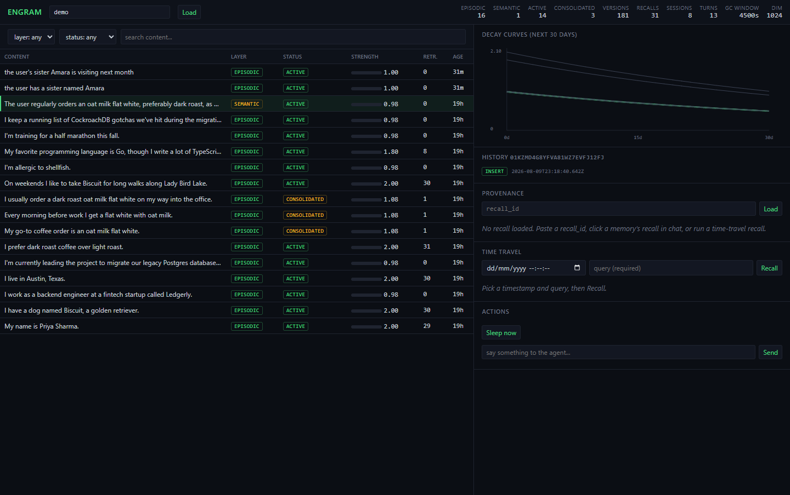

# Engram

Engram is a CockroachDB-native memory engine for AI agents. It manages
memory decay with half-lives, consolidates episodic memories into semantic
ones, and recalls memories with scoped vector search. It keeps a dual-layer
time-travel audit of what an agent knew and when: `AS OF SYSTEM TIME` reads
inside the GC window, and append-only `memory_versions` replay beyond it.

Built for the CockroachDB x AWS Build with Agentic Memory hackathon.

## Live demo

- Dashboard: https://7ooxrsy3fga63z5f6dfadv2d3a0vtddf.lambda-url.us-east-1.on.aws/dashboard (enter scope `demo` and click Load)
- Chat with the memory-backed agent:
  ```
  curl -X POST https://7ooxrsy3fga63z5f6dfadv2d3a0vtddf.lambda-url.us-east-1.on.aws/chat \
    -H "content-type: application/json" \
    -d '{"scope_id":"demo","message":"what is my dog called?"}'
  ```
- Runs on AWS Lambda + CockroachDB Cloud (serverless) + Amazon Bedrock (Titan V2 embeddings, Claude). Real-path recall p50 is ~240ms server-side, under the 300ms target (`scripts/spike/RESULTS-latency.md`).



## Quickstart

Requires Node 24+. From a clean clone:

```
npm install
scripts/test-db-up.ps1   # Windows; use scripts/test-db-up.sh on Linux/macOS
npx tsx src/migrate.ts
npm test
```

Tests need zero AWS access. `ENGRAM_FAKE_BEDROCK=1` (set in `.env.example`)
makes `src/embeddings.ts` and `src/llm.ts` return deterministic fake output
instead of calling Bedrock.

## API

No auth (the demo is public and unauthenticated by design). Every route
validates `scope_id` and caps input length at the boundary; bad input
returns `400 {"error": "..."}`.

| Method | Path | Body / params | Returns |
|---|---|---|---|
| POST | `/chat` | `scope_id`, `session_id?`, `message` | `{reply, recall_id, remembered[], session_id}` |
| POST | `/api/remember` | `scope_id`, `content`, `layer?`, `tags?` | the created memory |
| POST | `/api/recall` | `scope_id`, `query`, `k?`, `as_of?` | `{recallId, memories}`, or `{memories, usedReplay}` when `as_of` is set |
| POST | `/api/sleep` | `scope_id` | consolidation result: `{clusters, consolidated, created}` |
| GET | `/api/memories?scope_id=&status=&layer=&q=` | query params | list of memories, each with `strengthNow` |
| GET | `/api/memory/:id/history?scope_id=` | query param | version history for one memory |
| GET | `/api/provenance/:recall_id?scope_id=` | query param | the recall_log entry a reply was built from |
| GET | `/api/introspect?scope_id=` | query param | engine stats: counts by layer/status, version/recall/session/turn totals, GC window |
| GET | `/dashboard` | - | `public/dashboard.html` |
| GET | `/health` | - | `{ok: true}` |

### Cross-session demo

`scripts/demo-chat.mjs` proves memory persists across sessions: one session
tells the agent a fact, a brand new session (same scope) asks about it, and
the reply surfaces the fact.

```
scripts/test-db-up.ps1     # start local CockroachDB (scripts/test-db-up.sh on Linux/macOS)
npx tsx src/server.ts      # start the local server (port 8787 by default)
node scripts/demo-chat.mjs # run the demo against it
```

## MCP

Engram ships its own MCP server (`src/mcp/server.ts`, stdio transport, built
on `@modelcontextprotocol/sdk`) so any MCP client (Claude Code, Claude
Desktop, etc.) can call the store directly. Same validation caps as the
HTTP boundary (`src/validate.ts`), same store functions, no direct SQL.

Run it:

```
npm run mcp
```

Register it with Claude Code:

```
claude mcp add engram -- npx tsx C:/path/to/engram/src/mcp/server.ts
```

Five tools:

| Tool | Description |
|---|---|
| `remember` | Store a new memory in a scope. |
| `recall` | Scoped vector recall of memories matching a query. |
| `recall_asof` | Historical recall as of a past timestamp (AS OF SYSTEM TIME or `memory_versions` replay). |
| `reflect` | Sleep/consolidation job: clusters episodic memories into semantic ones. |
| `introspect` | Engine stats for a scope: counts by layer/status, version/recall/session/turn totals, GC window. |

### CockroachDB Cloud Managed MCP Server

Separately from the server above, CockroachDB Cloud runs its own hosted MCP
endpoint at `https://cockroachlabs.cloud/mcp` for cluster introspection:
schema, table stats, and query diagnostics, scoped to one cluster by an
`mcp-cluster-id` header. It needs no code in this repo; it is a registration
on the MCP client side, pointed at the engram demo cluster.

Registration pattern (replace the placeholder with your own cluster id -
never commit a real one):

```
claude mcp add cockroachdb-cloud https://cockroachlabs.cloud/mcp --transport http --header "mcp-cluster-id: <your-cluster-id>"
```

The engram demo cluster is registered this way. Worked example a judge can
run once registered: ask the client "using the cockroachdb-cloud MCP server,
show me the schema of the `memories` table and its row count on the engram
cluster" - the client calls the Managed MCP Server directly against the live
cluster, no engram code involved.

## CockroachDB tools + AWS services used

| Tool / service | Where used | Status |
|---|---|---|
| CockroachDB Distributed Vector Indexing | `migrations/0001_core.sql`, `migrations/0002_vector_index_status.sql`, `src/store/memories.ts` recall | SHIPPED |
| MCP wrapper (this repo's server) | `src/mcp/server.ts` | SHIPPED |
| CockroachDB Cloud Managed MCP Server | Cluster introspection, see [CockroachDB Cloud Managed MCP Server](#cockroachdb-cloud-managed-mcp-server) | registered |
| ccloud CLI | Ops/setup | optional |
| Amazon Bedrock - Titan Text Embeddings V2 + Claude | `src/embeddings.ts`, `src/llm.ts` | SHIPPED |
| AWS Lambda | Deploy | SHIPPED |

## Disclosure

Engram's memory model (decay, consolidation, scoped recall, versioned audit)
follows the design of hippo (github.com/kitfunso/hippo-memory), an
open-source project by the same author. This is design pedigree only: all
code in this repository was newly written during the hackathon submission
period. No code is copied from hippo.

## Data growth

`memory_versions` and `recall_log` are append-only and grow unbounded by
design. Fine at demo scale; retention policy is deferred post-hackathon.
